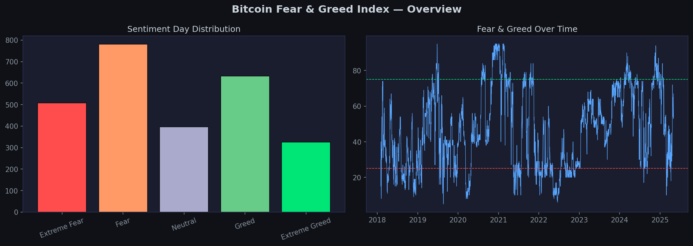
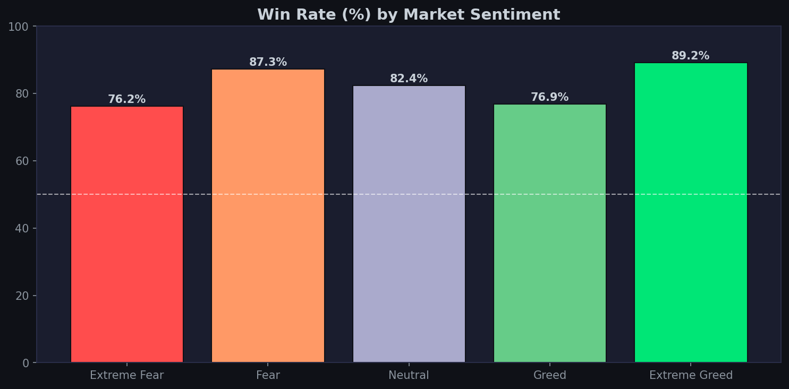
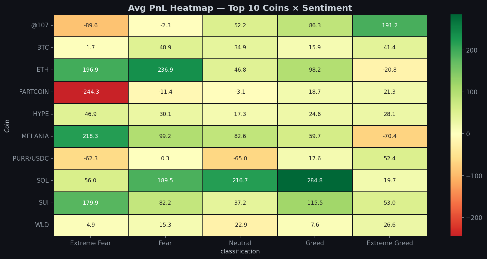
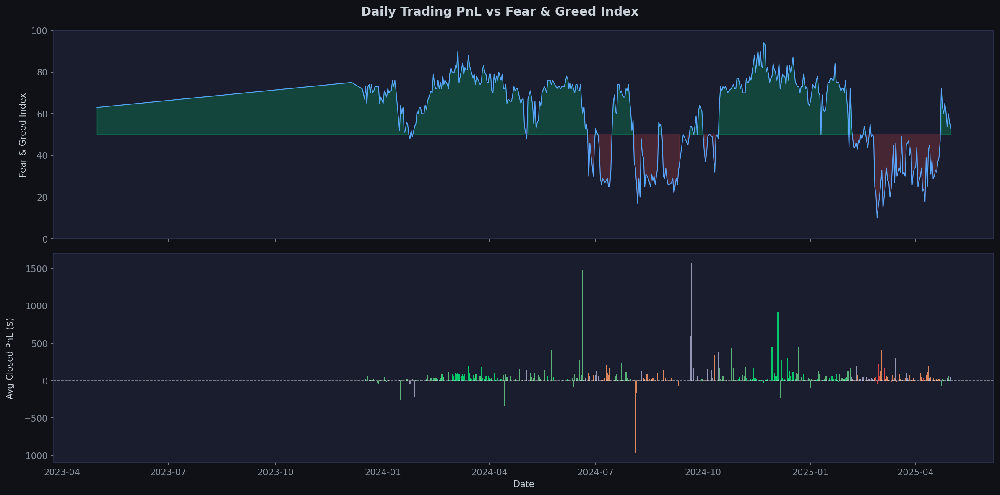
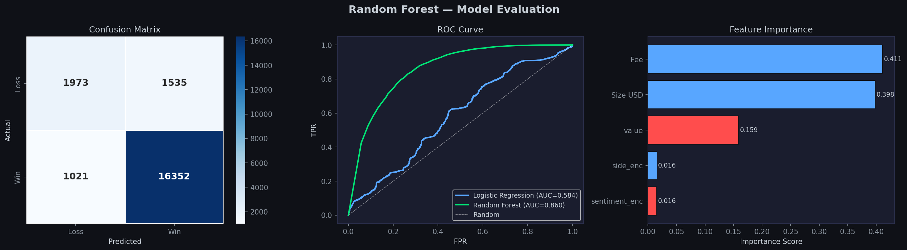
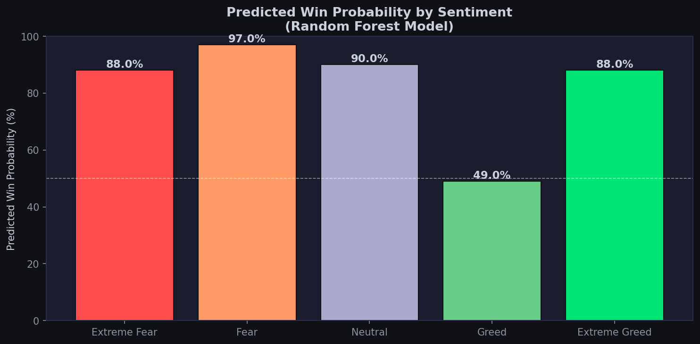
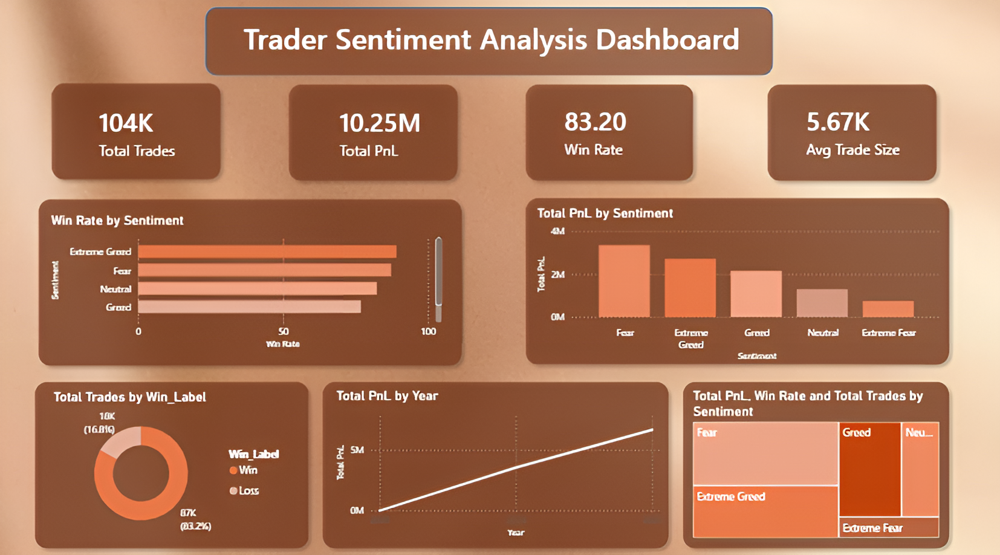

# Trader Sentiment Analysis — Market Psychology Meets On-Chain Data

**An end-to-end data analytics project uncovering how crypto market sentiment influences real trader behavior and profitability.**

<p align="center">
  
  
  
  
</p>

<p align="center">
Understanding how traders behave in Fear vs Greed markets
</p>

---

## 🌟About the Project

Financial markets are driven as much by **emotion** as by logic.

This project combines:
- A **market sentiment index (Fear & Greed)**
- Real **on-chain trading data from Hyperliquid DEX**

to analyze how trader behavior changes under different emotional states — and whether sentiment can actually predict profitability.

> Focus: Not just analysis, but extracting **actionable trading insights from behavioral patterns**

---

## 🎯Problem Statement

Crypto traders often rely on sentiment indicators like the Fear & Greed Index.

But key questions remain:

✤ Do traders actually behave differently in Fear vs Greed?  
✤ Are certain market conditions more profitable?  
✤ Do smart traders act differently from the crowd?  
✤ Can sentiment be used as a **trading signal**?  

---

## 🔗Datasets

### 1. Fear & Greed Index
- Daily sentiment score (0–100)
- Categories: Extreme Fear → Extreme Greed
- Time range: **Feb 2018 – May 2025**

### 2. Hyperliquid Trader Data
- **211,000+ real trades**
- **246 unique coins**
- Includes:
  - Trade size
  - Execution price
  - Buy/Sell side
  - Profit & Loss (PnL)

| Dataset | Records | Range |
|---|---|---|
| Bitcoin Fear & Greed Index | 2,645 days | Feb 2018 – May 2025 |
| Hyperliquid Trader Data | 211,224 trades | May 2023 – May 2025 |

Merged on `date` → **211,218 sentiment-tagged trades**

---

## 🚀Features

✤ Exploratory Data Analysis of sentiment trends  
✤ On-chain trader behavior analysis  
✤ Sentiment vs Profitability study  
✤ Win rate and trade size comparison  
✤ Coin-level performance insights  
✤ Contrarian trader identification  
✤ Correlation analysis (statistical validation)  
✤ Heatmaps & timeline overlays for pattern discovery  
✤ ML classification model to predict trade outcomes  
✤ SQL-based analysis across 6 analytical dimensions  
✤ Interactive Power BI dashboard  

---

## 📁Project Architecture

**Data Sources**  <br>
(Fear & Greed Index + Hyperliquid Trades) <br>
↓  <br>
**Data Cleaning & Processing**  <br>
(Date alignment, feature engineering)  <br>
↓  <br>
**EDA & Visualization**  <br>
(Behavioral and statistical exploration)  <br>
↓  <br>
**Sentiment-Based Analysis**  <br>
(PnL, win rate, trade size, volume)  <br>
↓  <br>
**Pattern Discovery Layer**  <br>
(Contrarian strategies, coin insights)  <br>
↓  <br>
**ML Classification Model**  <br>
(Predicting trade outcomes — Random Forest, 87.76% accuracy)  <br>
↓  <br>
**SQL Analysis**  <br>
(16 queries across 6 analytical dimensions)  <br>
↓  <br>
**Power BI Dashboard**  <br>
(Interactive visual reporting) <br>  
↓  <br>
**Strategy Recommendations** <br>

---

## 🛠️Tech Stack

| Category | Tools |
|---|---|
| Language | Python 3.12 |
| Analysis | Pandas, NumPy |
| Visualization | Matplotlib, Seaborn |
| Statistics | SciPy |
| Machine Learning | Scikit-learn |
| Database Queries | SQL |
| Dashboard | Power BI |
| Environment | Jupyter Notebook |

---

## 📁Project Structure

```
trader-sentiment-analysis/
│
├── analysis.ipynb                  ← EDA & sentiment analysis
├── model.ipynb                     ← ML classification model
├── queries.sql                     ← SQL analysis queries
├── fear_greed_index.csv
├── historical_data.csv
├── plots/                          ← 13 generated visualizations
├── Dashboard.png                   ← Power BI dashboard screenshot
└── README.md
```

---

## 📊Key Insights

### 1. Extreme Greed = Highest Win Rate
- ~89% win rate during extreme greed
- Momentum-driven strategies perform best

### 2. Fear = Largest Trades
- Traders place **2.5× bigger trades** during fear
- Indicates aggressive "buy the dip" behavior

### 3. Contrarian Traders Dominate
- Top traders made **millions in PnL**
- Strategy: Buy during Fear, not Greed

### 4. HYPE Coin Dominance
- ~32% of total trades
- Consistently profitable across sentiment conditions

### 5. Sentiment is a Weak Signal Alone
- Positive but weak correlation with:
  - PnL
  - Win rate
- Must be combined with other indicators

---

## 🤖ML Classification Model

Built a binary classifier to predict whether a trade will be profitable (`is_win`).

| Model | Accuracy | ROC-AUC |
|---|---|---|
| Logistic Regression | 83.20% | 0.5838 |
| **Random Forest** | **87.76%** | **0.8597** ✅ |

**Top Features by Importance:**

| Feature | Importance | Insight |
|---|---|---|
| Fee | 0.411 | Higher fees = larger, more convicted trades |
| Size USD | 0.398 | Bigger trades tend to be more profitable |
| F&G Value | 0.159 | **Sentiment has a real, measurable impact** |
| Side (Buy/Sell) | 0.016 | Direction matters less than size |

> The model confirms that market sentiment is a statistically meaningful predictor of trade profitability.

---

## 📷Sample Visualizations








---

## 📊Power BI Dashboard



---
## 📑 Project Playbook
For a visual walkthrough of the full analysis, findings and strategy recommendations,
view the [Project Playbook](TraderSentiment_Playbook.pptx)

---

## 📈Behavioral Patterns Discovered

✤ Extreme Fear → Traders **buy more than sell**  
✤ Extreme Greed → Traders **sell to take profits**  
✤ Fear markets → Higher conviction trades  
✤ Greed markets → Safer, smaller trades  

---

## 📌Strategy Playbook

| Sentiment | Observed Behavior | Recommended Strategy |
|---|---|---|
| Extreme Greed | Small trades, more SELL | Ride momentum, take profits |
| Greed | Balanced activity | Follow trend cautiously |
| Neutral | Low conviction | Wait for confirmation |
| Fear | Large trades, more BUY | Scale into positions |
| Extreme Fear | Aggressive dip buying | Accumulate long-term positions |

---

## ▶️How to Run

### 1. Clone Repository
```bash
git clone https://github.com/saxena-693/trader-sentiment-analysis
cd trader-sentiment-analysis
```

### 2. Install Dependencies
```bash
pip install pandas numpy matplotlib seaborn jupyterlab scikit-learn scipy
```

### 3. Run EDA Notebook
```bash
jupyter notebook analysis.ipynb
```
> Then run all cells: Kernel → Restart & Run All

### 4. Run ML Model Notebook
```bash
jupyter notebook model.ipynb
```
> Running this also exports `powerbi_trader_sentiment.csv` for the Power BI dashboard

### 5. SQL Queries
> Open `queries.sql` in any SQL editor (DB Browser for SQLite, DBeaver, etc.) and run against the merged dataset.

---

## 📚Key Learnings

✤ Market psychology directly impacts trading behavior  
✤ On-chain data provides real behavioral insights  
✤ Sentiment indicators are useful but not standalone signals  
✤ Data storytelling is crucial in financial analytics  
✤ Identifying "smart money" patterns is highly valuable  
✤ ML models can extract predictive signal from behavioral + sentiment data  

---

## 🔮Future Improvements

✤ Build a sentiment-based trading model  
✤ Real-time sentiment + trading dashboard  
✤ Strategy backtesting engine  
✤ Integration with live crypto APIs  

---

## 👩‍💻Author

**Nandini Saxena** <br>
🎓B.Tech (Computer Science & Engineering) <br>
💡Interested in Data Analytics, Machine Learning & Business Intelligence <br>

<p align="center">
  <a href="https://www.linkedin.com/in/nandini-saxena-codes" target="_blank">
    
  </a>
  
  <a href="https://nandinisaxena.netlify.app/" target="_blank">
    
  </a>
</p>

<p align="center">✨If you found this project insightful, consider giving it a star✨</p>
